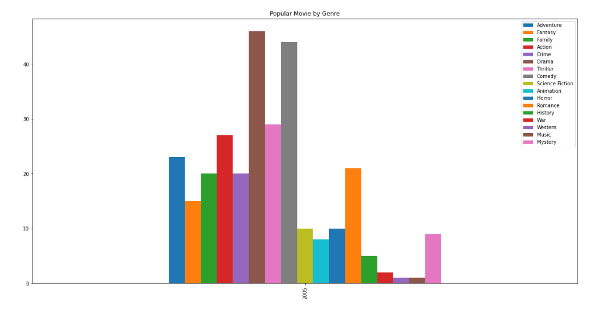
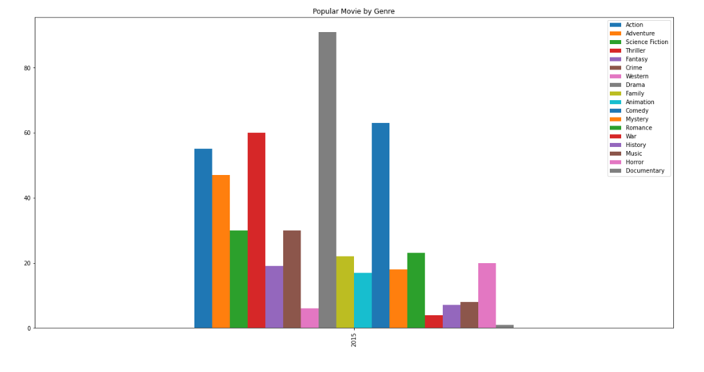

# Investigate as dataset (TMDb movie data set)

Investigation finds secret information by digging data. The TMDb movie data is used that contians information about 10000 movies. 
A logical method of investigation fetches out relevant information. This project shows the practical application of methods 
we should follow. So, it start with questions and end with the conclusions. Every part uses the relevant technologies and 
output accordingly. The outputs are belong tentative solution. However, I tzried to find the best one to show the meaningful insight of data.  

### Prerequisites

python 3.5, pandas, matplotlib.

## Authors

* **MD ABU YUSUF** - [mayusuf](https://github.com/mayusuf)
